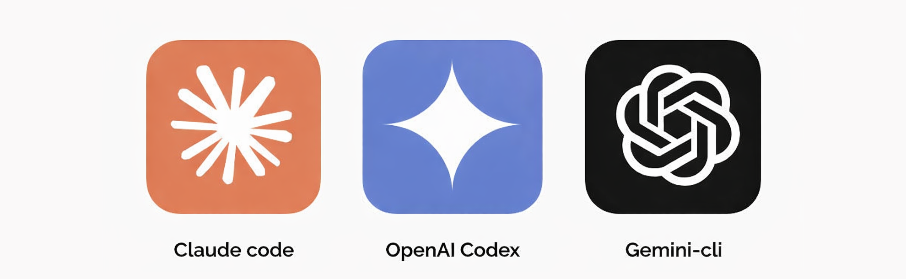

# attention-please

Codex & Claude skill that notifies you when your attention is needed.



Plays a macOS ping and says: "Project NAME needs your attention."

## Install

### Codex

Global install (available in all projects), then restart Codex:

```bash
git clone https://github.com/Mindgames/attention-please.git ~/.codex/skills/public/attention-please
```

Project install (only this repo), then restart Codex:

```bash
git clone https://github.com/Mindgames/attention-please.git /path/to/your-repo/.codex/skills/attention-please
```

### Claude Code / Claude CLI

Global install (available in all projects), then restart Claude:

```bash
git clone https://github.com/Mindgames/attention-please.git ~/.claude/skills/attention-please
```

Project install (only this repo), then restart Claude:

```bash
git clone https://github.com/Mindgames/attention-please.git /path/to/your-repo/.claude/skills/attention-please
```

## Use

Tell your agent to run the skill at the end of each turn or when input/confirmation is needed:

```text
Please update AGENTS.md to run the attention-please skill at the end of each turn or when input/confirmation is needed.
```

Run the script manually from the repo you want announced:

```bash
~/.codex/skills/public/attention-please/scripts/attention-please.sh
```

If you installed for Claude, run:

```bash
~/.claude/skills/attention-please/scripts/attention-please.sh
```

If you installed at the project level, run:

```bash
./.codex/skills/attention-please/scripts/attention-please.sh
```

```bash
./.claude/skills/attention-please/scripts/attention-please.sh
```
