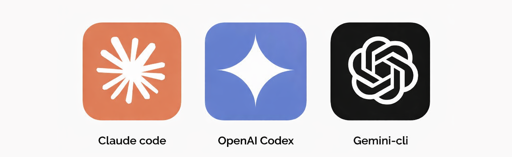

# Attention Please

A Codex and Claude Agent SKILL that notifies you when your attention is needed.



Attention Please is an Agent SKILL that boosts your productivity by telling you when a turn ends or when your input is required.

Compatible with macOS today. Windows and Linux are coming soon.

## Install (skills.sh)

Install via `skills.sh`:

```bash
npx skills add Mindgames/attention-please
```

Global install:

```bash
npx skills add Mindgames/attention-please -g -y
```

## Instruct your Agent

Tell your agent to run the skill at the end of each turn or when input/confirmation is needed:

```text
$attention-please update AGENTS.md to run the attention-please skill at the end of each turn or when input/confirmation is needed.
```

## Audio sample

WAV clip (not in repository code):

<video controls width="320" preload="none">
  <source src="https://github.com/Mindgames/attention-please/releases/download/audio-sample-john-doe-20260302/attention-please-john-doe.mp4" type="video/mp4">
  Your browser does not support the media player.
</video>

If inline playback is blocked, use one of these files:

- MP4 player fallback: [Project john doe needs your attention](https://github.com/Mindgames/attention-please/releases/download/audio-sample-john-doe-20260302/attention-please-john-doe.mp4)
- WAV original: [Project john doe needs your attention](https://github.com/Mindgames/attention-please/releases/download/audio-sample-john-doe-20260302/attention-please-john-doe.wav)

Issue with the hosted clip: [#5](https://github.com/Mindgames/attention-please/issues/5)

---

Follow me on X: https://x.com/mathiiias123
