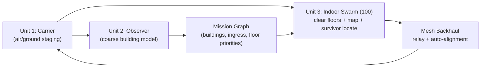

# Whitepaper: 3-Unit Urban SAR System (Carrier + Observer + 100-Drone Indoor Swarm)

## Abstract

This whitepaper specifies a non-weaponized urban search-and-rescue (SAR) system based on three coordinated units: a deployment carrier, one aerial observer, and an indoor swarm of roughly 100 micro-drones. The system objective is rapid survivor localization in GPS-denied buildings with resilient communication and low per-unit compute cost. The key engineering result remains: indoor-specialized swarm drones can operate with approximately `0.1-0.3 TOPS` provisioned compute per drone, while single-platform all-domain drones often require `10-20+ TOPS` effective for equivalent mission scope, yielding a large compute-efficiency advantage through specialization.

## 1) Requirements and Constraints

Hard requirements:

- Unit 1: **Carrier** (air or ground) to transport and stage assets.
- Unit 2: **Observer** (single high-altitude unit) for building-level understanding.
- Unit 3: **Swarm** (~100 units) to clear buildings, map floors, and find survivors.
- Swarm onboard compute: **below $100 per drone**.
- Swarm sensing: LiDAR + object detection for survivor-state inference.
- Networking: self-forming mesh with automatic range-extension behavior in weak-signal areas.
- Data output: fused swarm telemetry must produce high-quality 3D meshes that are saved for future operations.

Operational boundary:

- Use case is SAR and emergency response.
- No weaponization or harm-focused guidance.

## 2) Three-Unit System Architecture

### 2.1 Unit roles

- **Carrier**
  - Launch/recovery, battery logistics, high-power compute back-end, and command uplink.
- **Observer (single unit)**
  - Fast exterior map seed, ingress probability scoring, roofline obstruction map, and dynamic no-fly cues.
- **Swarm (100 units)**
  - Room/corridor exploration, floor mapping, survivor candidate detection, and marker landing/perching.

## 3) Design Corrections to Improve Feasibility

Two changes are recommended to make your design robust:

- **Observer altitude policy**: flying "far above" is often suboptimal for urban detail and link quality. Better: adaptive altitude bands (roofline + elevated overview passes).
- **LiDAR on all 100 units**: generally not cost- and weight-optimal. Better: heterogeneous swarm while keeping total at 100 units.

### Recommended 100-unit split

- `60 Scout units`: camera + lightweight depth (ToF/stereo), low-cost AI compute.
- `25 Mapper units`: add compact LiDAR for geometry-critical and stair-core mapping.
- `15 Relay units`: mesh-priority nodes with perch behavior and minimal perception load.

This keeps total swarm count at 100 while reducing weight, power, and cost pressure.

## 4) Compute Need Comparison

## 4.1 Method

Inputs:

- Model FLOPs references from Ultralytics tables [S2].
- Embedded AI envelope references from NVIDIA Jetson family [S1].
- Conservative deployment headroom factor for jitter, I/O overhead, and fail-safe behavior.

## 4.2 Scenario A: Indoor specialist swarm drone

Representative workload:

- 1 camera, 320-480 input, 8-12 FPS detector.
- Local navigation, short-horizon obstacle avoidance, room-level mapping.
- Optional compact LiDAR fusion on mapper subset.

Budget estimate:

- Detection: ~`0.01-0.08 TOPS` effective.
- Nav/control/map updates: ~`0.02-0.08 TOPS` effective.
- Deployment margin (~3x): provision around `0.1-0.3 TOPS`.

## 4.3 Scenario B: Single large all-domain drone (open + urban + indoor)

Representative workload:

- Multi-camera high-resolution detection and tracking.
- Mixed-context navigation and scene interpretation.
- Broad mission-state fusion and transition logic.

Budget estimate:

- Detection-heavy configurations can exceed `8 TOPS` equivalent.
- End-to-end stacks commonly land in `10-20+ TOPS` effective.

## 4.4 Comparison result

A role-specialized indoor swarm architecture remains roughly **50x-200x** lower in per-agent compute requirement than a single all-domain approach under representative settings.

## 5) Under-$100 Swarm Compute Plan

Compute-cost target applies to onboard compute electronics, not full flight hardware.
All listed prices are point-in-time references captured on 2026-03-02 and should be treated as procurement estimates.

### 5.1 Candidate module classes

| Tier | Example module | Indicative price | Compute note | Fit |
| --- | --- | --- | --- | --- |
| L | LuckFox Pico Plus (RV1103) [S7] | $13.99-$14.99 | NPU class suitable for lightweight vision triggers | Scout / Relay |
| M | reCamera 2002 (8GB) [S8] | 53.90 EUR listed | 1 TOPS class AI camera module | Scout / Mapper |
| Optional | DWM3000 UWB module [S9] | $23.62 listed | Improves ranging/localization handoff | Mapper / Relay |

### 5.2 Practical unit targets

- Scout compute target: `$20-$70`.
- Mapper compute target (with richer fusion): `$40-$95`.
- Relay compute target: `$15-$50`.

This keeps the `<$100` compute constraint feasible for all swarm roles.

## 6) LiDAR + Object Detection for Survivor State

## 6.1 Why mixed sensing

- Vision is strong for class cues and posture hints.
- LiDAR is strong for geometry and obstacle profile.
- Thermal (if added) helps in smoke/low-light but increases BOM/power.

## 6.2 Recommended sensing allocation

- Use compact LiDAR (e.g., TF-Luna class [S10][S11]) on mapper subgroup.
- Use ToF/stereo on most scouts for lower mass and energy draw.
- Fuse cues at carrier/edge compute for final survivor-state confidence.

## 6.3 Survivor-state inference stages

1. Candidate detection (person-like signatures).
2. Temporal consistency (multi-frame confirmation).
3. Motion and pose cues (stillness/micro-movement markers).
4. LiDAR context gate (occlusion/clearance/approach safety).
5. Confidence score and marker decision.

## 7) Mesh Network and Auto-Alignment

## 7.1 Mesh base

- ESP-WIFI-MESH provides self-forming and self-healing behavior with high node-scale references [S12][S13].
- Thread/BLE mesh can complement lower-bandwidth roles [S14][S15].

## 7.2 Auto-alignment behavior

Each drone updates a link-quality score from:

- RSSI/SNR
- Packet loss
- Queue delay
- Hop depth

When score drops below threshold, nearby relay-assigned units reposition to restore path margin. Repositioning should prefer perch points to reduce energy burn.

## 7.3 Capacity realism for 100 units

A 100-node swarm should not assume all units stream high-rate data simultaneously. Better policy:

- Event-driven uplink for scouts.
- Mapper-only high-rate bursts.
- Time-slotting or tokenized uplink windows per floor/zone.

## 8) Building and Floor Clearing Logic

1. Observer creates coarse exterior model and ingress ranking.
2. Carrier builds a mission graph: building -> floor -> zone -> room.
3. Swarm receives partitioned assignments with dynamic rebalance.
4. Relay units establish communication spine from ingress points.
5. Scouts/mappers execute frontier exploration with local collision avoidance.
6. Completion criteria per zone: coverage threshold + confidence threshold + comms health.

## 8.1 Persistent 3D mesh deliverable

Beyond immediate rescue support, the swarm should output a reusable 3D mesh package per operation:

- Building shell + floor topology
- Obstacle/debris map layers
- Traversable path graph for responders
- Timestamped confidence layers for uncertain geometry

These meshes become reusable assets for future missions, rehearsal planning, and faster re-entry operations.

## 9) Risks and Mitigations

- **Single observer failure risk**
  - Mitigation: fallback observer profile on carrier or short-term relay promotion.
- **Mesh saturation in dense interiors**
  - Mitigation: event-first telemetry, uplink scheduling, role-based bandwidth limits.
- **LiDAR cost and mass creep**
  - Mitigation: mapper-only LiDAR policy and periodic BOM gates.
- **False survivor positives in clutter/smoke**
  - Mitigation: multi-modal confirmation and abstain policy [S17].
- **Sim-to-real gap**
  - Mitigation: profile on target hardware early, not just offline benchmarks.

## 10) Execution Plan (v0.1 -> v0.3)

## v0.1 (2-3 weeks): architecture and cost proof

- Finalize 100-unit role split and compute BOM.
- Implement mesh emulator with auto-alignment logic.
- Build tunable compute model (resolution/FPS/model-size/hops).

## v0.2 (3-5 weeks): closed-building trial

- 10-20 physical units with representative role mix.
- Validate floor clearing, relay placement, and marker behavior.
- Metrics: time-to-locate, false alerts/hour, map coverage, link uptime.

## v0.3 (6-10 weeks): scale rehearsal

- Scale toward 50-100 in mixed simulation + staged hardware waves.
- Validate scheduling and bandwidth controls under stress.
- Freeze deployment doctrine for real responder pilots.

## 11) Recommendation

Keep your 3-unit concept as the program backbone. For best feasibility, implement it as a heterogeneous 100-unit swarm with strict role budgets, adaptive observer altitude, and mesh auto-alignment driven by link quality. This preserves your vision while making cost, compute, and operations tractable.

## References

- [S1] NVIDIA Jetson Orin: https://www.nvidia.com/en-us/autonomous-machines/embedded-systems/jetson-orin/
- [S2] Ultralytics README: https://raw.githubusercontent.com/ultralytics/ultralytics/main/README.md
- [S3] Bitcraze Crazyflie 2.1: https://www.bitcraze.io/products/crazyflie-2-1/
- [S4] Bitcraze AI-deck 1.1: https://www.bitcraze.io/products/ai-deck/
- [S5] GreenWaves GAP8: https://greenwaves-technologies.com/gap8_iot_application_processor/
- [S6] DJI Matrice 30 specs PDF: https://dl.djicdn.com/downloads/Matrice_30/20250828/Matrice_30_Series_Specifications_en.pdf
- [S7] Waveshare LuckFox Pico Plus: https://www.waveshare.com/luckfox-pico-plus.htm
- [S8] reCamera 2002 (retail page): https://www.gotronic.fr/art-recamera-2022-8gb-47670.htm
- [S9] Qorvo DWM3000: https://store.qorvo.com/products/detail/dwm3000-qorvo/681949/
- [S10] TF-Luna (spec-focused listing): https://www.lumenier.com/products/benewake-tf-luna-lidar
- [S11] TF-Luna (retail pricing listing): https://www.robotshop.com/products/benewake-tf-luna-8m-lidar-distance-sensor
- [S12] Espressif ESP-WIFI-MESH overview: https://www.espressif.com/en/products/software/esp-mesh/overview
- [S13] ESP-IDF Wi-Fi Mesh guide: https://docs.espressif.com/projects/esp-idf/en/stable/esp32/api-guides/esp-wifi-mesh.html
- [S14] Espressif mesh comparison: https://docs.espressif.com/projects/esp-techpedia/en/latest/esp-friends/solution-introduction/mesh/mesh-comparison.html
- [S15] Bluetooth Mesh FAQ: https://www.bluetooth.com/learn-about-bluetooth/feature-enhancements/mesh/mesh-faq/
- [S16] YOLC tiny aerial objects: https://arxiv.org/abs/2304.04466
- [S17] Thermal UAV victim detection (Drones 2025): https://www.mdpi.com/2504-446X/9/9/625
- [S18] DARPA Fast Lightweight Autonomy: https://www.darpa.mil/research/programs/fast-lightweight-autonomy
- [S19] NIST UAS indoor mapping challenge: https://www.nist.gov/el/intelligent-systems-division-73500/uav-indoor-mapping-challenge
- [S20] DJI Mavic 3 Enterprise specs: https://enterprise.dji.com/es/mavic-3-enterprise/specs
